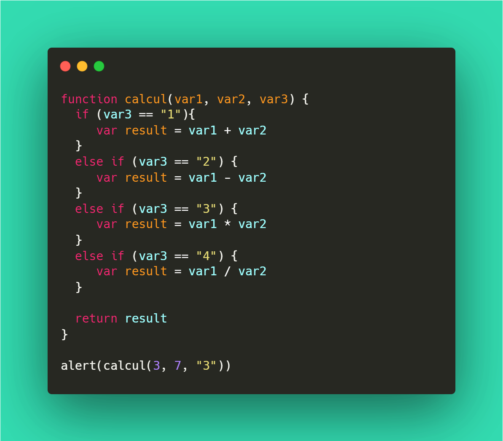

<h1>CONCOURS D'ALGHORITHME</h1>
<hr>
<h2>Task#1</h2><sub>3 points</sub>

<br>

```javascript

function calcul(var1, var2, var3) {
  if (var3 == "1"){
   	 var result = var1 + var2
  }
  else if (var3 == "2") {
     var result = var1 - var2
  }
  else if (var3 == "3") {
     var result = var1 * var2
  }
  else if (var3 == "4") {
     var result = var1 / var2
  }
  
  return result
}

alert(calcul(3, 7, "3"))
```
<ol>
  <li>Lisez ce code. Que retournera la fonction alert() ?</li>
   <li>Que retournera le script si on modifier la dernière ligne par  `alert(calcul(1, 0, "4"))` ?</li>
</ol>
<h3>Ressources</h3>
<a href="https://developer.mozilla.org/en-US/docs/Web/JavaScript/Guide/Functions" ><p>Functions</p></a>
<hr>
<h2>Task#2</h2><sub>4 points</sub>

<br>

```javascript
var username = prompt("Nom d'utilisateur :")
var password = prompt("Mot de passe :")

function connnexion(user, pass, true_user, true_pass) {      
  
    if (user === true_user && pass === true_pass) {
        var message = "Connexion reussi"
    }
    else {
        var message = "Connexion invalide"
    }

    return message
}

alert(connexion(username, password, "root"))
```
<ol>
  <li>Lisez ce script. A quoi correspond "root" (dernière ligne) ?</li>
  <li>Ce script contient une erreur. Trouver le bug et résolvez-le.</li>
  <li>Récupérer et stocker dans une variable `char` le 3ème caractère du mot de passe.</li>
</ol>
<h3>Ressources</h3>
<a href="https://developer.mozilla.org/fr/docs/Web/JavaScript/Reference/Global_Objects/String/slice" ><p>String.prototype.slice()</p></a>
<hr>
<h2>Task#3</h2><sub>5 points</sub>

<br>

```javascript
var phrase = "Le chien promena son maître."
```
<ol>
  <li>Stocker chaques mots de la chaîne de caractère dans un tableau `words`.</li>
  <li>Quel est la valeur de `world[3]` ? A quel mot correspont-il ?</li>
  <li>Récupérer les deux premiers caractères de `world[3]`</li>
</ol>
<h3>Ressources</h3>
<a href="https://developer.mozilla.org/fr/docs/Web/JavaScript/Reference/Global_Objects/String/split" ><p>String.prototype.split()</p></a>
<hr>
<h2>Task#4</h2><sub>7 points</sub>

<br>
<ol>
  <li>Créer un mini-jeux. Le programme génére <b>au hazard</b> un nombre entre 0 & 100.</li>
  <li>L'utilisateur doit deviner ce nombre. Il entrera son nombre dans un prompt.</li>
  <li>Si le nombre entrée est égal au nombre généré alors l'utilisateur gagne. Sinon, le programme lui indique si le chiffre est plus petit ou plus grand.</li>
  <li>Le nombre de tour sera affiché quand l'utilisateur gagnera la partie.</li>
</ol>
<h3>Ressources</h3>
<a href="https://developer.mozilla.org/fr/docs/Web/JavaScript/Reference/Global_Objects/Math/random" ><p>Math.random()</p></a>
<hr>
